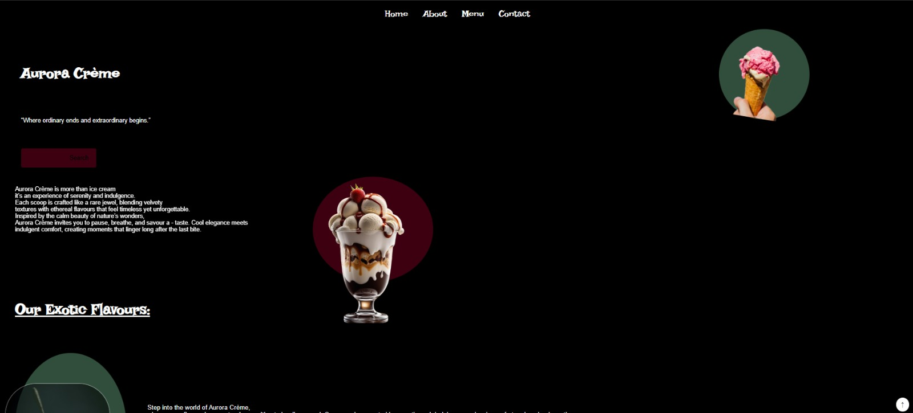

# 🍦 Aurora Crème – Ice Cream Website

Aurora Crème is a fun, whimsical ice-cream-themed website that I built as my **first ever web project** and my **first Figma design**.

I wanted this project to be more than just following a tutorial. I put myself in a position where I had to figure things out on my own and see how much I could actually build and explore with what I knew.

Honestly, this project took me almost a whole month. There was a lot of trial and error, getting stuck, figuring things out, and motivating myself to keep going. Looking back, that's probably what makes this project special to me — it was where I really started learning by **building instead of just learning**.

## 🌈 Features

* 🍨 Ice cream flavors and combo sections
* 🎨 Frosty, pastel-inspired design
* ✨ Hover effects and animations
* 🖥️ Custom design created in Figma
* 💻 Built from scratch with HTML, CSS and JavaScript

## 🖼️ Preview



## 🔜 Future Improvements

There are still a few things I'd like to explore and improve:

* More interactive animations
* Smooth scrolling and clickable navigation
* Additional ice cream flavors and sections
* Better mobile responsiveness

## 🛠️ Built With

* HTML
* CSS
* JavaScript
* Figma

## 🖥️ How to View

Clone the repository:

```bash
git clone https://github.com/Flockstock/ice-cream-website.git
```

Then open the project in your browser.

---

**A small project, but an important one for me — this is where I started. 🍦**
